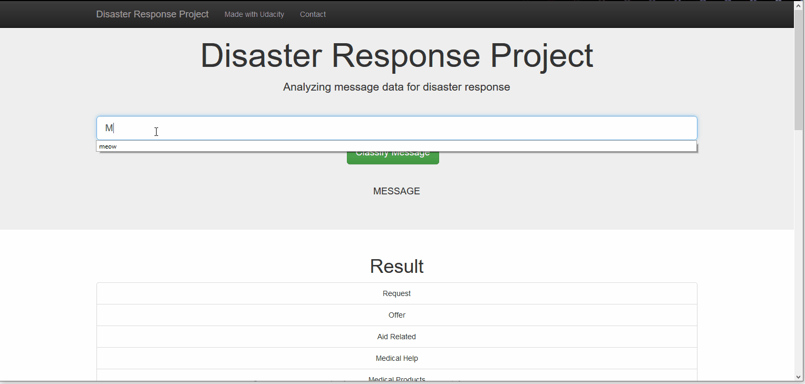

# Disaster Response Pipeline Project

## Table of contents


  - [Table of contents](#table-of-contents)
  - [Introduction](#introduction)
  - [Local Development](#local)
  - [Project structure description](#project-structure-description)
  - [Author](#Author)
  - [Licence](#licence)
  - [Acknowledgements](#Acknowledgements)

## Introduction 

**Goal: Analyze disaster data from [Figure Eight](https://www.figure-eight.com) to build a model for an API that classifies disaster messages.**

In the project, you'll find a data set containing real messages that were sent during disaster events. You will be creating a machine learning pipeline to categorize these events so that you can send the messages to an appropriate disaster relief agency.

Project will include a web app where an emergency worker can input a new message and get classification results in several categories. The web app will also display visualizations of the data. 

## Motivation

Machine learning is critical helping different organizations understanding which messages are relevant to them and which messages to prioritize during disaster times. During these disasters is when they have the least capacity to filter out the messages that matter and finding basic messages such as using key word searches to provide trivial results.



## Local Development


* Open Anaconda Prompt
* (shiny_new_env)$ conda deactivate # exit the current venv
* conda create -n disaster_response python=3.7 # Activate it
* conda activate disaster_response 
* pip install -r requirements.txt # Install packages from requirements.txt
* You might also try  conda install -r requirements.txt if pip installation conflicts are giving you trouble.

1. Run the following commands in the project's root directory to set up your database and model.

    - To run ETL pipeline that cleans data and stores in database
        `python data/process_data.py data/disaster_messages.csv data/disaster_categories.csv data/disaster_response.db`
    - To run ML pipeline that trains classifier and saves
        `python models/train_classifier.py data/disaster_response.db models/model.pkl`
        
    1. Run the following command in the app's directory to run your web app.
        cd ap

2. Go to http://localhost:3001/

## Project structure description

```
|   .gitignore
|   ETL Pipeline Preparation.ipynb
|   ML Pipeline Preparation.ipynb
|   README.md
|
+---app
|   |   run.py
|   |
|   \---templates
|           go.html
|           master.html
|
+---data
|       disaster_categories.csv
|       disaster_messages.csv
|       disaster_response.db
|       process_data.py
|
\---models
        model.pkl
        train_classifier.py
```

#### ETL Pipeline

Python script, `process_data.py`, contains data cleaning pipeline that:

- Loads the `messages` and `categories` datasets

- Merges the two datasets

- Cleans the data 

- Stores it in a SQLite database

  

#### ML Pipeline

Python script, `train_classifier.py`, contains machine learning pipeline that:

- Loads data from the SQLite database

- Splits the dataset into training and test sets

- Builds a text processing and machine learning pipeline

- Trains and tunes a model using GridSearchCV

- Outputs results on the test set

- Exports the final model as a pickle file

  

#### Flask Web App

Flask web app is located in the app folder.

Application uses the output of the ETL pipeline and ML pipeline and utilizes output ML model to predict

the output category of newly written messages.


**Development notebooks** can be found in 

* ETL Pipeline Preparation.ipynb
* ML Pipeline Preparation.ipynb

## Author

Kristijan Bakaric


## License: [MIT](https://opensource.org/licenses/MIT)

## Acknowledgements

[Udacity](https://www.udacity.com) for providing such a complete Data Science Nanodegree Program
[Figure Eight](https://www.figure-eight.com) for providing messages dataset to train my model